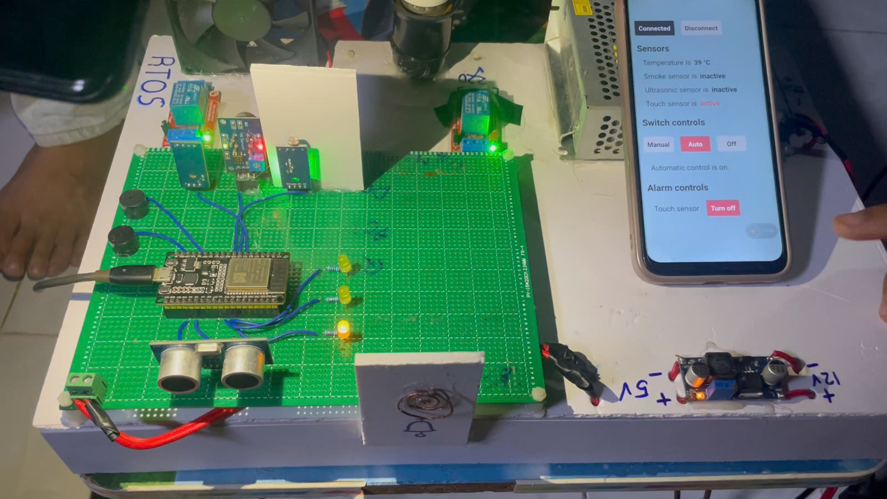
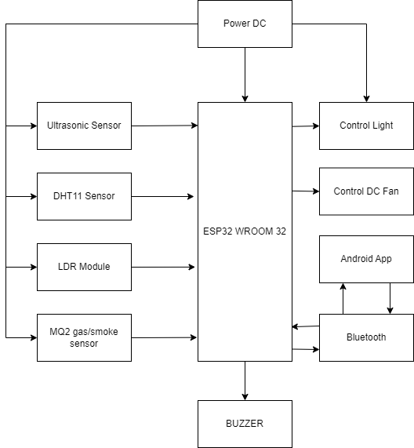
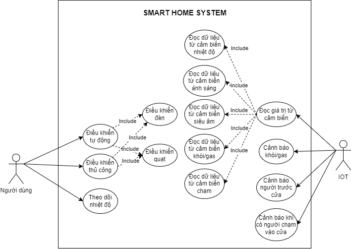
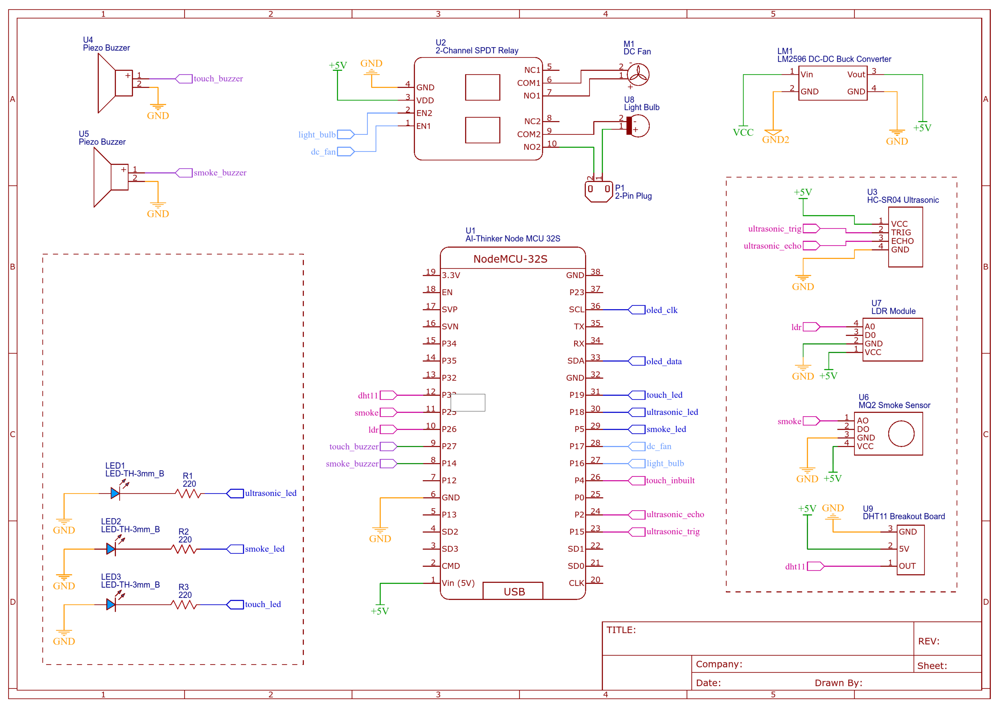
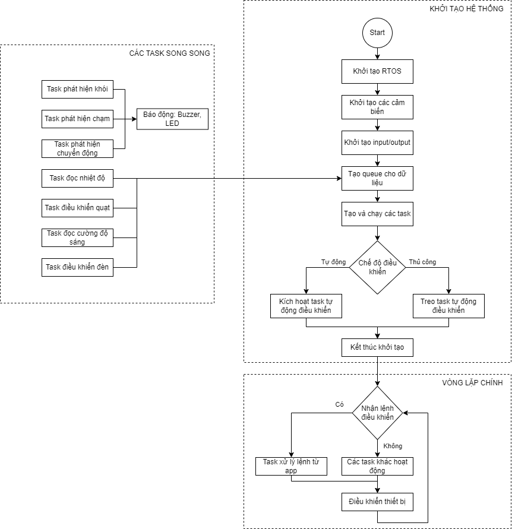
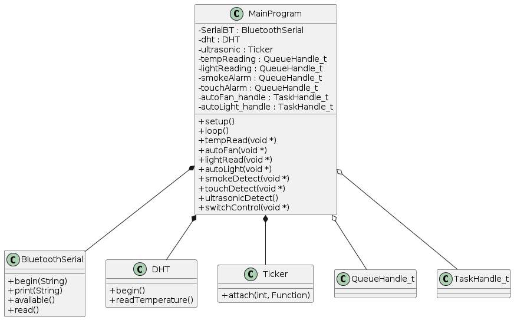
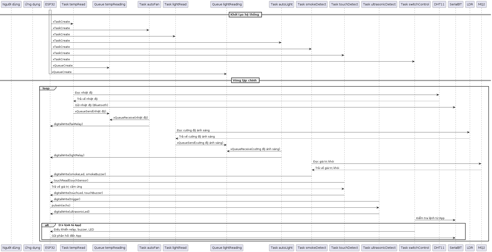

	

## The Smart Home Automation System developed on the ESP32 microcontroller using freeRTOS with intelligent features. The entire system is wirelessly controlled via Bluetooth using a dedicated Android application.

## Demo

- **YouTube** - [youtu.be/aT6Lj6hBVUk](https://youtu.be/20nzQ2bZeyc)

<iframe width="90%" height="90%" src="https://youtu.be/20nzQ2bZeyc" frameborder="0" allow="accelerometer; autoplay; encrypted-media; gyroscope; picture-in-picture" allowfullscreen></iframe>

## Requirements
### Block Diagram

	

### Use Case Diagram

	

## Features

- Wireless control via Bluetooth
- Dedicated Android application
- Activity monitoring on the app
- Temperature sensing using DHT11 sensor
- Light intensity sensing using LDR
- Fan/light control in 3 modes – manual, automatic (sensor-based), and off
- Door presence detection using ultrasonic sensor
- Door touch detection with alarm using ESP32's integrated touch sensor
- Smoke detection with alarm using MQ2 sensor

## Hardware

### System Overview

- The entire system is custom-designed with planned wiring and installation locations based on requirements.
- Designed to simulate a room in a house.

	

### Requirements

- ESP32 Microcontroller
- DHT11 Temperature and Humidity sensor
- LDR module
- MQ2 Gas/Smoke Sensor
- Ultrasonic Sensor
- Relay
- Buzzers
- LEDs
- Bulb
- DC fan

### Circuit Diagram

The components can be assembled and connected as shown in the schematic.

	

## Software

To program the microcontroller, **Arduino IDE** is used, which is compatible with ESP32.

### Algorithm Flowchart

	

### Class Diagram

	

### Sequence Diagram

	

### How to connect ESP32 to Arduino IDE?

- Download and install Arduino IDE
- Install ESP32 Library in `File -> Preference -> Additional Boards Manager URLs:` https://raw.githubusercontent.com/espressif/arduino-esp32/gh-pages/package_esp32_index.json
- Then go to `Tools -> Board Manager` -> search for ESP32 and install

### Libraries

Certain libraries are required for the microcontroller and the interfacing components to function correctly.

- [Bluetooth Serial](https://github.com/espressif/arduino-esp32/tree/master/libraries/BluetoothSerial)
- [Wire](https://github.com/esp8266/Arduino/blob/master/libraries/Wire/)
- [DHT](https://github.com/adafruit/DHT-sensor-library)
- [Adafruit_SSD1306](https://github.com/adafruit/Adafruit_SSD1306)
- [Adafruit_GFX](https://github.com/adafruit/Adafruit-GFX-Library)
- [Ticker](https://github.com/espressif/arduino-esp32/tree/master/libraries/Ticker)

### Real-Time Operating System

- Another essential software component is **freeRTOS**, which is responsible for the real-time operation of the system's components.
- ESP32 natively supports freeRTOS in Arduino IDE with its own flavor on top of the original for proper integration.

### Android Application

The Android app was developed using the [MIT App Inventor](https://appinventor.mit.edu/) platform.